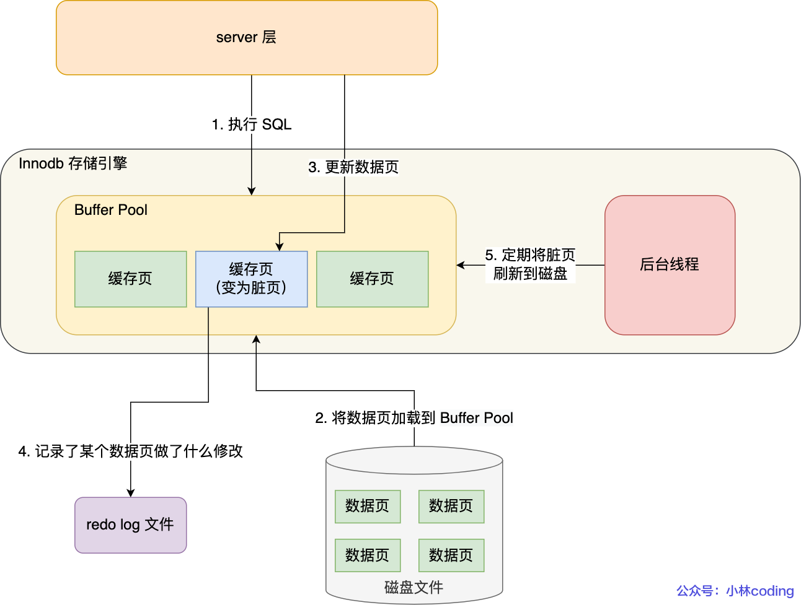
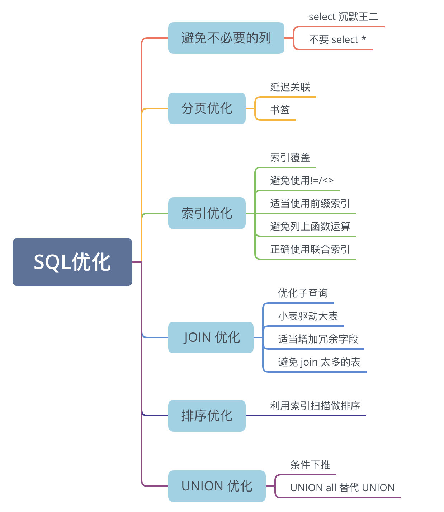

mysql执行delete之后,数据会立刻删除吗? 

> 不会,因为删除操作开启日志,被删除的record会打上delete tag,由后台线程purge进行删除.


sql过来了怎么处理? 分为server层和存储引擎,server是公用的,存储引擎有innodb,myisam,memo,用来具体存储数据.

myisam和innodb的区别?

> 事务,锁粒度,外键,日志支持,MVCC,聚簇索引,count(*)性能
>
> 聚簇索引: 数据和索引放在一起,而MyISAM只支持二级索引,叶子节点存放的是数据的物理地址.

如何选择存储引擎?

> 大多数情况下，使用默认的 InnoDB,MyISAM 适合读多写少的场景。MEMORY 适合临时表，数据量不大的情况。

观察innodb, 想一个表是怎么在引擎中存储的,引出索引与聚簇索引,表的存储与聚簇索引相关, 这种索引结构广为出现. 所以索引的种类?

> 数据结构角度: B+树索引,哈希索引,全文索引
>
> 物理存储: 聚簇索引,非聚簇索引
>
> 逻辑特性: 主键索引,唯一索引,普通索引,联合索引,前缀索引

为什么用B+树不用B树?

> B 树的每个节点既存储键值，又存储数据和指针，导致单节点存储的键值数量较少
>
> B+ 树的叶子节点通过双向链表顺序连接，范围查询只需定位起始点后顺序遍历链表即可
>
> B树查询时间波动较大,而且删除时容易引起频繁表结构变更.

思考到联合索引时,自然想到这种索引的结构与最左匹配,想一下最左匹配出现范围查询时,为什么>=能用到索引,>用不到. 

联合索引中什么叫做索引下推?

> 把判断过程改成在联合索引进行而不是回表主键索引,是一种优化方式.

覆盖索引指的是什么?

> 覆盖索引是指一个索引已经包含了查询所需的所有字段，MySQL 只需要读索引就能返回结果，不需要再回表查询实际的数据行。

然后是什么时候需要索引?什么时候不需要?

> 数据量小,或者查询返回大部分数据. 写操作多的表. 区分度低或者不常用来查询的的列
>
> 需要索引: 经常用于条件判断的列, join中经常用的列,经常用于分组和排序的列. 数据量大的表.
>
> 对于主键和唯一约束的列,自动创建索引,对于外键列,它引用外表的唯一列,推荐建立索引.

索引失效是什么?场景?

> 失效指的是没有使用本应该使用的索引
>
> 1. 在查询条件上对索引列操作:
>    1. 索引列使用了函数,或者存在针对列存在隐式类型转换,比如列是char类型,转换为int类型
>       1. MySQL有一个内置的类型转换优先级规则：**数字类型的优先级高于字符串类型**。所以列是字符串,跟数字比较,所有的行都会转换.
>    2. 使用了通配符开头的模糊查询
>    3. 或者使用 or 的时候,A or B, B没有索引会导致全表扫描,即便A和B都有索引,也要进行合并去重,所以也有可能导致索引失效 
>    4. 使用 `!=` 或 `<>` 不等值查询会导致索引失效
> 2. 联合索引: 联合索引不满足最左前缀原则
> 3. 优化器的选择: 作用在区分度低的列,或者小表,或者返回的行数占表的绝大部分


# 事务

索引之所以重要是因为它跟经常用到的sql查询息息相关,能极大提高查询效率.

而几个sql一起执行会相互影响,并且sql执行过程中如果数据库崩溃必须要恢复,数据表也要保证一致性. 所以引入事务概念. 

事务本身有ACID特性,保证事务之间互不影响. 如何保证这些特性? 

> 原子性引入了undo log, 
>
> 隔离性引入MVCC和锁,为了实现隔离性,定义隔离级别.
>
> 持久性引入redo log. 事务的特性需要日志支持,日志不像索引那样直观,而是在暗处提供保障. 日志还有binlog处于server层面. 主要为了数据库备份以及主从复制.
>
> 一致性是最终目标,通过其他三个来保证

下面重点是隔离性的实现,涉及到隔离级别,以及隔离级别的实现.

事务的并发执行导致了哪些问题? 隔离级别有哪些?

> 脏读,不可重复读,幻读.
>
> 脏读是指一个事务读取到另一个事务未提交的数据；
> 不可重复读是指在一个事务内，多次读取同一行数据，结果不一致（由于其他已提交事务的修改或删除）；
> 幻读是指在一个事务内，多次执行同一个查询，返回的行数不一致（由于其他事务的插入或删除）。
>
> 定义事务隔离级别, 决定多大程度上事务能相互影响: 读已提交,不可重复读,可重复读,序列化

可重复读与不可重复读的区别?

> 根据这两个级别的定义,引入MVCC的快照读和当前读. 可重复读只会在第一次读的时候生成一次快照Read View,而不可重复读每次select都会生成一次快照.
>
> 快照读不加锁,每次读取某个可见版本,当前读会加锁,通过 next-key lock实现. 
>

为什么InnoDB 引擎的可重复读很大程度上避免了幻读?  哪些幻读不可避免?

> MVCC避免了幻读,通过快照读和当前读的实现方式
>
> 因为快照读使用mvcc 一个事务只能读到第一次读的时候读到的快照.,当前读:使用next-key锁,锁定区间所以避免了幻读.
>
> 不可避免的幻读的例子: 先快照读，再当前读，中间被别的事务插入了数据,
>
> ```sql
> -- 事务A
> BEGIN;
> SELECT * FROM orders WHERE amount > 100;
> -- 返回2行（快照读，基于MVCC）
> 
>                     -- 事务B
>                     BEGIN;
>                     INSERT INTO orders (amount) VALUES (200);
>                     COMMIT;
> 
> -- 事务A（继续）
> UPDATE orders SET status = 'checked' WHERE amount > 100;
> -- 影响了3行！（当前读，能看到事务B插入的那行）
> 
> SELECT * FROM orders WHERE amount > 100;
> -- 返回3行（因为自己刚UPDATE过那行，纳入了自己的事务版本）
> COMMIT;
> ```
>
> MVCC快照读和当前读走的是两套机制,快照读没有加next-key,导致快照读和当前读中间被另一个事务在范围内插入了数据.
>
> update一旦更新,那么插入的200数据就属于事务A能看到的了,所以第二次select就有三行.
>
> 避免的方式: 一开始就用当前读（SELECT ... FOR UPDATE），这样会加间隙锁

# 日志相关

mysql日志主要分为undo,redo和binlog日志.

对于binlog在主从复制中,还存在**Relay Log**,从库存储主库binlog的文件,用于从库回放数据.

慢查询日志记录执行时间超过阈值的 SQL 语句. 以及mysql本身的错误日志.

## 原子性与undo日志

聚簇索引中的两个隐藏字段? 他们和undo日志的关系?

> 隐藏字段分别是修改数据页的事务ID以及回滚指针roll_ptr
>
> 每次事务修改一行数据时，InnoDB会把修改前的旧版本写入undo log.然后更新当前行的DB_TRX_ID为当前事务ID，同时把DB_ROLL_PTR指向undo log中刚保存的那个旧版本.这样就形成了一个undo旧版本链

事务没提交后中断,需要进行回滚,用到undo 日志.undo log的主要功能?

> 事务回滚和MVCC,undolog记录回滚需要的信息. 每一次产生一个版本的undo log,都会在roll_pointer中加入一条链表节点.

undo log的刷盘方式?

> 首先刷新到buffer pool,然后刷新到磁盘,会跟redo log进行结合,用redo log保证持久化

## 持久性与redo日志

redolog的作用?

> 保证持久性用到redo log, 通过WAL,实现数据写磁盘的随机写变为顺序写,提升性能.
>
> 同时redo log提供对undo log的持久性支持. 

我们知道对数据页的修改是修改在buffer pool缓存中,产生脏页.必须要及时进行刷盘. redo log实现了刷盘的部分功能,通过WAL,也就是刷盘前先记录日志,能够实现顺序记录redo log,随后后台进行进行脏页刷盘的异步操作. 把脏页的随机刷盘变成了redo log的顺序刷盘



redo log是什么?会直接写到磁盘吗? 

> redo log本质上是循环写的物理日志,记录物理更改
>
> 不会直接写磁盘,在特定时机会进行刷盘, 这里有个redo log的刷盘策略.

## server层的binlog

讨论完了锁和事务,来看看server层的binlog日志.事务执行过程中,先写binlog cache,事务提交之后才会把cache写入binlog,一个线程同时只能执行一个事务,所以一个事务的binlog不能拆开,如果拆开在从库里就会识别为两个事务.

看看binlog的特点,首先是server层的,任何存储引擎都可以使用,它分为三种格式?

> statement(逻辑日志),row(记录数据行最终修改结果),mixed(包含statement和row). 

binlog是追加写,保存全量日志.为什么?

保证binlog与redo log的一致性, 用到两阶段提交,他的概念?

> 
> mysql重启后扫描redo log,发现状态为commit,说明已经提交.
>
> 为prepare,有可能没提交.从redolog拿到xid,到binlog里,看binlog有无xid,事务是否提交就看binlog是否有xid

主从复制:

# 锁相关


在实现了事务之后,我们知道MVCC使用了锁,锁的种类有哪些?

> 数据库备份加全局锁.使数据库**只读**，用于**全库备份**。
>
> 表级锁:
>
> 1. 表锁,基本的锁,MyISAM默认使用的,表示修改表的可读和可写状态.读锁允许多个事务读表,不允许写.写锁只允许一个事务进行写操作，其他事务不能读也不能写。
>
> 2. 修改表结构会加元数据锁,MDL元数据锁在对行CRUD时加读锁,表结构变更的操作会试图加写锁
>
> 3. 表级意向锁.自动添加.对表中一行记录加共享锁和独占锁时,会分别加表级意向共享锁和表级意向独占锁,目的是**提高加表锁时的判断效率**。这俩种锁不会跟行级锁冲突,这两个意向锁之间也不会冲突,加行级S锁之前，先加表级**IS锁**（意向共享锁）加行级X锁之前，先加表级**IX锁**（意向排他锁）
>
>    意向锁的本质是一个表级别的"快速标记"，让加表锁的操作不需要逐行检查是否存在行锁，把冲突检测的复杂度从O(N)降到O(1)。它只在行锁和表锁共存的场景下才有意义. 
>
>    如果存在意向排他锁，则不能加表级共享锁或排他锁.如果存在意向共享锁，则不能加表级排他锁
>
> 4. AUTO-INC 锁 (自增锁).是一种特殊的表级锁，在向**包含自增列**的表中插入数据时使用。保证在**并发插入**的情况下，自增值能够**唯一且连续**地生成。
>
> 行锁:
>
> 记录锁,间隙锁,和临键锁, 以及插入意向锁.
>
> 记录锁分为行级读锁,写锁. 
>
> 记录锁+gap lock就是next-key lock,它会锁定一个范围,并且锁定记录. 所以当前读实现了next-key lock.Next-Key Lock是锁结构,具体行锁部分是X锁还是S锁，由你的操作决定
>
> 间隙锁锁住一个范围,并且两个事务可以在同一个间隙上加锁,互不阻塞,间隙锁之间是兼容的.
>
> 插入意向锁是特殊的间隙锁,会在试图在间隙锁范围内insert时出现,并且处于阻塞等待状态,插入意向锁锁住一个点, 间隙锁释放之后才会获得插入意向锁.

InnoDB行级锁如何实现的?

> 基于**索引**实现的。它通过在索引记录上加锁来锁定对应的行

传统锁机制导致大量等待,MVCC的核心思想不是通过加锁在解决冲突,而是通过保存多版本,使得读操作不加锁读取旧版本,提高吞吐量

什么是MVCC?

> 多版本并发控制，每次修改数据时，都会生成一个新的版本,它的快照读根本不加锁,所以不会阻塞.底层实现主要依赖于 Undo Log 和 Read View。
>
> 分为当前读和快照读.实现方式依赖版本链,ReadView,以及可见性判断.
>

当前读有哪些?

> 普通的select是快照读,不加锁.
>
> （SELECT ... FOR UPDATE）和SELECT ... IN SHARE MODE都是当前读,一个加排他锁,一个加共享锁.
>
> 增删改也是当前读.

那么Read View包含什么? 

> Read View的四个核心字段:
>
> - creator_trx_id：创建该 ReadView 的事务 ID。
> - m_ids：所有活跃事务的 ID 列表，活跃事务是指那些已经开始但尚未提交的事务。
> - min_trx_id：所有活跃事务中最小的事务 ID。它是 m_ids 数组中最小的事务 ID。
> - max_trx_id ：事务 ID 的最大值加一。换句话说，它是下一个将要生成的事务 ID。

Read View 是如何被垃圾回收的?

> 当一个事务提交或回滚后，它所创建的 Read View 就不再需要了。系统会有一个后台线程（Purge 线程）来扫描 Undo Log，清理那些不再被任何活跃事务的 Read View 引用的旧版本数据。

如何进行可见性判断?

> 如果某个数据版本的 DB_TRX_ID 小于 min_trx_id，则该数据版本在生成 ReadView 之前就已经提交，因此对当前事务是可见的。
>
> 如果 DB_TRX_ID 大于 max_trx_id，则表示创建该数据版本的事务在生成 ReadView 之后开始，因此对当前事务不可见。
>
> 如果 DB_TRX_ID 在 min_trx_id 和 max_trx_id 之间，需要判断 DB_TRX_ID 是否在 m_ids 列表中：
>
> - 不在，表示创建该数据版本的事务在生成 ReadView 之后已经提交，因此对当前事务也是可见的。
> - 在，表示事务仍然活跃，或者在当前事务生成 ReadView 之后才开始，因此是不可见的。

MVCC的快照读如何使用版本链?

> 数据表(聚簇索引)中的两个隐藏字段trx_id和roll_ptr. 从当前行出发，顺着DB_ROLL_PTR往回找，比对每个版本的DB_TRX_ID和自己的ReadView，找到第一个自己"有资格看到"的版本，那就是快照读的结果。


# 高可用

为了保障高可用,会进行读写分离和主从复制,以及分库分表.

主从复制的过程?

> 主库执行事务提交时，将数据变更以事件形式记录到 Binlog,从库通过 I/O 线程从主库的 Binlog 中读取变更事件，并将这些事件写入到本地的中继日志文件中.SQL 线程会实时监控中继日志的内容，按顺序读取并执行这些事件，从而保证从库与主库数据一致。
>
> 主库在提交事务写入binlog之后,会把binlog同步到所有从库,每个从库把binlog写入到暂存日志delaylog中,然后从库回放binlog,更新innodb数据. 从库会创建IO线程链接主库log dump线程,接收主库的binlog存放到暂存日志,然后再用一个线程回放binlog的数据.
>

为了避免网络导致的主从同步延迟解决?

> 对一致性要求高的查询（如支付结果查询）可以直接走主库。非关键业务允许短暂数据不一致，可以提示用户“数据同步中，请稍后刷新”，然后借助异步通知机制替代实时查询。
>
> 采用半同步复制，主库在事务提交时，要等至少一个从库确认收到 binlog（但不要求执行完成），才算提交成功。
>

怎么分库?

> 垂直分库：按照业务模块将不同的表拆分到不同的库中，比如说用户、登录、权限等表放在用户库中，商品、分类、库存放在商品库中
>
> 水平分库：按照一定的策略将一个表中的数据拆分到多个库中，比如哈希分片和范围分片，对用户 id 进行取模运算或者范围划分，将数据分散到不同的库中。
>

怎么分表?

> 也分为水平拆分和垂直拆分
>

如何避免分库分表带来的问题:

> 跨库事务无法依赖单机 MySQL 的 ACID 特性.用分布式事务.
>
> 跨库后无法使用 JOIN 联表查询。可以在业务层进行拼接
>
> 自增 ID 在分片场景下容易冲突，需要使用全局唯一方案。数据库表被切分后，不能再依赖数据库自身的主键生成机制,保证主键全局唯一用雪花算法.
>

雪花算法怎么实现?

> 使用一个 64 位的数字来作为全局唯一 ID。符号位+时间戳+工作机器ID+12 位的序列号.
>

# 数据表

数据库表设计,用到的范式理论?

> 第一范式原子性，确保表的每一列都是不可分割的基本数据单元,后面的两个范式讲的是表的普通字段与主键的关系,第二范式消除部分依赖:每一个列都跟主键直接相关,非主键字段必须完全依赖于整个主键,第三范式消除传递依赖:非主键列应该只依赖于主键列,非主键字段不能依赖于另一个非主键字段
>
> 第二范式（2NF）解决的是部分依赖问题：在满足1NF的基础上，要求所有非主属性必须完全依赖于整个主键，不能只依赖主键的一部分。这个问题只在联合主键的表中才会出现。第三范式（3NF）解决的是传递依赖问题：在满足2NF的基础上，要求非主属性之间不能存在依赖关系，即非主属性必须直接依赖于主键，不能通过另一个非主属性间接依赖。


表定义有很多字段类型,讨论下他们

varchar与char的区别?

> char(10)固定长度10,不够的用空格填充. 

blob和text区别?

> blob存储二进制文件,text存储文本数据, 

datetime和timestamp的区别?

> DATETIME 直接存储日期和时间的完整值，与时区无关。 TIMESTAMP存储1970-01-01 00:00:01 UTC 以来的秒数,为unix时间戳,受到时区影响. datetime默认值null,timestamp默认值为current_timestamp

in和exists区别?

> in适合结果集小的情况,exists适合结果集大,因为exists只需要判断只有一个行存在

记录货币用DECIMAL(19,4)更好,不能用浮点数存在误差.

存储emoji需要使用 utf8mb4 字符集,因为emoji是4字节的utf-8字符,MySQL 的 utf8 字符集只支持最多 3 个字节的 UTF-8 字符.

drop、delete 与 truncate 的区别？ 

> DROP 是物理删除，用来删除整张表，包括表结构，且不能回滚。DELETE 支持行级删除，可以带 WHERE 条件，可以回滚。TRUNCATE 用于清空表中的所有数据，但会保留表结构，不能回滚。

# sql语句

sql语句首先能写对,然后对慢sql进行优化.

sql执行顺序?

> **FROM** — 确定数据来源，包括JOIN
>
> **ON** — JOIN的连接条件过滤
>
> **WHERE** — 对行进行条件过滤
>
> **GROUP BY** — 分组
>
> **HAVING** — 对分组后的结果过滤
>
> **SELECT** — 选择输出哪些列，计算表达式
>
> **DISTINCT** — 去重
>
> **ORDER BY** — 排序
>
> **LIMIT** — 限制返回行数
>
> SELECT中的各列在逻辑上是同时计算的，不存在先后顺序,所以**同一个SELECT里的列不能引用同层定义的别名**。
>
> `DISTINCT` 是修饰整个 `SELECT` 的，不是修饰某一列。它对**所有选出的列的组合**去重。`DISTINCT` 要么跟在 `SELECT` 后面对整行去重，要么放在聚合函数括号里对单列去重。如
>
> ```sql
> SELECT DISTINCT city, department FROM employees; 对(city, department)这个组合去重
> SELECT COUNT(DISTINCT city) FROM employees; 先对city去重，再计数
> ```
>
> 

一些mysql函数: 

> - `CONCAT()`: 用于连接两个或多个字符串。
> - `LENGTH()`: 用于返回字符串的长度。
> - `SUBSTRING()`: 从字符串中提取子字符串。
> - `REPLACE()`: 替换字符串中的某部分。
> - `TRIM()`: 去除字符串两侧的空格或其他指定字符。
> - `ABS()`: 返回一个数的绝对值。
> - `ROUND()`: 四舍五入到指定的小数位数。
> - `MOD()`: 返回除法操作的余数。
> - `NOW()`: 返回当前的日期和时间。
> - `CURDATE()`: 返回当前的日期。
> - `SUM()`: 计算数值列的总和。
> - `AVG()`: 计算数值列的平均值。
> - `COUNT()`: 计算某列的行数。
> - `IF()`: 如果条件为真，则返回一个值；否则返回另一个值。
> - `CASE`: 根据一系列条件返回值。
>
> ```sql
> -- IF函数
> SELECT IF(1 > 0, 'True', 'False') AS simple_if;
> 
> -- CASE表达式
> SELECT CASE WHEN 1 > 0 THEN 'True' ELSE 'False' END AS case_expression;
> ```
>


count(1),count(*),count(列名)区别?

> count(1)被优化为count(\*),count(\*)会走索引加速计算. count(列名)会剔除值为null的行.


一条select语句的执行过程?

> 
>
> 预处理:检查语法是否正确,验证表和字段是否存在
>
> 执行器根据优化器的执行计划,通过调用存储引擎的数据,实际进行处理.所以存储引擎并不执行执行计划.
>
> select在存储引擎中,涉及到数据页加载到bufferpool中,select如果是快照读会通过MVCC和ReadView判断读取哪个版本.
>
> 最后执行器经过处理,如果结果集很大，是边读边发的流式返回
>
> 为什么MySQL 8.0 移除了查询缓存？
> 缓存失效频繁（表更新即失效），维护成本高且命中率低。现代优化器能生成更高效执行计划，且应用层缓存（如 Redis)更灵活。

一条update语句的执行过程?

> 如果当前没有显式事务，InnoDB会自动开启一个事务（autocommit=1时隐式事务），分配事务ID. 然后加锁,update会加排他锁,是主键则加record锁,如果走的不是唯一索引或者是范围查询,则加上临键锁,防止幻读.
>
> 读取旧数据到buffer pool,然后记录undo log.更新buffer pool,同时更新隐藏列 `trx_id` 为当前事务ID。此时这个数据页变成了**脏页**.
>
> 把这次修改的物理变更写入 **Redo Log Buffer**，然后刷入磁盘的redo log文件，状态标记为 **prepare**。如果MySQL宕机，重启后可以通过redo log把已提交但还没刷盘的脏页数据恢复。这就是WAL（Write-Ahead Logging）机制——先写日志再写数据。
>
> 如果数据库开启了binlog,执行器将这条UPDATE语句写入 **Binlog Buffer**，然后刷入磁盘的binlog文件。
>
> Binlog写成功后，再把redo log的状态从prepare改为 **commit**。这就是**两阶段提交**，目的是保证redo log和binlog的一致性
>
> 事务提交后,释放锁,然后对脏页异步刷盘.
>
> 事务开始前,记录undo log,然后将更新操作写入redo log,状态标记为prepare,开启事务
>


sql优化部分: 什么是慢sql?

> long_query_time 的参数,执行时间超过这个参数就是慢sql,记录到慢查询日志中. 
>

优化慢sql方式?

> 先找到那些慢sql,可以开启慢查询日志, 设置 slow_query_log 参数为 1. 通过`SHOW VARIABLES LIKE 'slow_query_log%';` 找到慢查询日志.
>
> 先EXPLAIN 查看慢 SQL 的执行计划.
>
> 根据分析结果，通过
>
> 1. 索引优化
> 2. sql优化
> 3. 表结构优化
> 4. 架构优化
>    1. 架构:**读写分离**，读请求打到从库，降低主库压力。热点数据加**Redis缓存**，减少数据库访问


sql优化涉及到什么?


> 

为什么避免使用<>和!=?

> 因为`!=` 或者 `<>` 操作符会导致 MySQL 无法使用索引，从而导致全表扫描。可以把`column<>'aaa'`，改成`column>'aaa' or column<'aaa'`。

如何进行分页优化？

> 避免深度偏移带来的全表扫描,如 LIMIT 1000,20. 分页会导致变慢,由于 OFFSET 的存在，OFFSET 会导致 MySQL 必须扫描和跳过 offset + limit 条数据，这个过程是非常耗时的。
>
> 用延迟关联和添加书签.
>
> ```sql
> SELECT e.id, e.name, d.details
> FROM (
>     SELECT id
>     FROM employees
>     ORDER BY id
>     LIMIT 1000, 20
> ) AS sub # 延迟关联,先获取id,适用于从多个表中获取数据且主表行数较多的情况
> JOIN employees e ON sub.id = e.id
> JOIN department d ON e.department_id = d.id;
> # 添加书签
> SELECT id, name
> FROM users
> WHERE id > last_max_id  -- 假设last_max_id是上一页最后一行的ID
> ORDER BY id
> LIMIT 20;
> ```
>


优化子查询指的是什么?

> 用join代替子查询,JOIN 的 ON 条件能更直接地触发索引，而子查询可能因嵌套导致索引失效。JOIN 的一次连接操作替代了子查询的多次重复执行，尤其在大数据量的情况下性能差异明显

子查询中的标量子查询是什么?

> 出现在SELECT列表中，语义上要求子查询**必须返回一行一列**（或者零行，零行时返回NULL）,如果返回多行会直接报错.
>
> ```sql
> SELECT o.order_id, o.amount, 
>        (SELECT c.name # 标量,必须返回一行一列
>         FROM customers c 
>         WHERE c.customer_id = o.customer_id) AS customer_name
> FROM orders o;
> ```
>
> 在这个sql中,外层表的每一行orders都会触发一次子查询,而join会把两个表进行关联,连接操作为一次执行,并且可以通过索引快速关联数据
>


为什么小表驱动大表?

> - 如果大表的 JOIN 字段有索引，那么小表的每一行都可以通过索引快速匹配大表。时间复杂度为小表行数 N 乘以大表索引查找复杂度 log(大表行数 M)，总复杂度为 N*log(M)。所以小表的时间复杂度更低.
> - 如果大表没有索引,实际上小表驱动仍然更好，原因在于磁盘IO和Buffer Pool的利用效率. 假设小表A有100行，大表B有10000行。小表驱动大表时，大表被反复扫描100次。但因为MySQL有**Join Buffer**（Block Nested Loop Join），它会把驱动表的数据批量加载到内存的Join Buffer中，然后扫描一次被驱动表就和Buffer里的多行同时匹配。小表100行可能一次就全部装进Join Buffer，这样大表实际上**只需要全表扫描一次**。大表驱动小表时，需要把10000行装进Join Buffer，如果装不下就要分多批，每一批都要对小表做一次全表扫描。虽然小表本身不大，但**批次数更多，总的扫描次数更多**。
>   - 假设Join Buffer能装500行,小表驱动：100行 ÷ 500 = 1批 → 大表全表扫描 1次,大表驱动：10000行 ÷ 500 = 20批 → 小表全表扫描 20次
>   - 小表驱动大表的本质优势不仅仅是索引，而是**让驱动表尽量一次装进Join Buffer，减少被驱动表的扫描次数**。
> - 如果大表没有索引，需要将小表的数据加载到内存，再全表扫描大表进行匹配。
>
> - 当使用 join 时，MySQL 会选择数据量比较小的表作为驱动表，大表作为被驱动表。left join时,左表为驱动表. 让小表做驱动表.
>
>

为什么要避免使用 JOIN 关联太多的表？

> 多表 JOIN 需要缓存中间结果集，可能超出 join_buffer_size，这种情况下内存临时表就会转为磁盘临时表，性能也会急剧下降。
>

如何进行排序优化？

> 对 ORDER BY 涉及的字段创建索引，避免 filesort。如果是多个字段，联合索引需要保证 ORDER BY 的列是索引的最左前缀。调整排序参数,让排序在内存中完成.
>

慢sql优化中,如何分析执行计划?

> 分析explain的执行.查看 SQL 执行计划.最关注的字段是 type、key、rows 和 Extra。它们判断 SQL 有没有走索引、是否全表扫描、预估扫描行数是否太大，以及是否触发了 filesort 或临时表. 
>
> key如果为 PRIMARY,表示主键索引
>
> type={const(只找到一行),range(索引范围扫描),eq_ref(对主键join匹配),index(全索引扫描),ALL}如果 type=ALL 表示全表扫描,或者 Extra=Using filesort表示排序的字段不是索引,则需要进行优化. 
>
> extra取值三个: index,temporary table,filesort 如果temporary table超过了内存Memory引擎大小则会导致sql显著变慢.
>
> 什么是filesort?
>
> 当不能使用索引生成排序结果的时候，MySQL 需要自己进行排序，如果数据量比较小，会在内存中进行；如果数据量比较大就需要写临时文件到磁盘再排序，我们将这个过程称为文件排序。
>


## 常考sql题目


可以做牛客的sql题https://www.nowcoder.com/exam/oj?page=1&tab=SQL%E7%AF%87&topicId=82

左连接,右连接,和内连接的区别?

> **内连接（INNER JOIN）**：只返回两表中匹配的行，任何一边没匹配上的都丢弃。
>
> **左连接（LEFT JOIN）**：左表全部保留，右表没匹配上的部分填NULL。
>
> **右连接（RIGHT JOIN）**：右表全部保留，左表没匹配上的部分填NULL。

子查询可以出现在哪里?

> 可以出现在from和where中
>
> ```sql
> SELECT name FROM users WHERE id IN (SELECT user_id FROM orders);
> SELECT t.user_id, COUNT(*) FROM (SELECT * FROM orders WHERE amount > 100) t GROUP BY t.user_id;
> ```

using和on:

> ```sql
> SELECT * FROM a JOIN b USING (id);
> 等价于`JOIN b ON a.id = b.id。`
> ```

插入或者更新的实现:

> INSERT INTO users(id, name) VALUES (1, 'Tom') ON DUPLICATE KEY UPDATE name='Tom';

datetime格式和timestamp用法

> ```sql
> CREATE TABLE orders (
>     id INT PRIMARY KEY AUTO_INCREMENT,
>     content VARCHAR(255),
>     create_time TIMESTAMP DEFAULT CURRENT_TIMESTAMP,
>     update_time TIMESTAMP DEFAULT CURRENT_TIMESTAMP ON UPDATE CURRENT_TIMESTAMP,
>     custom_time TIMESTAMP
> );
> 
> INSERT INTO orders (content, custom_time) 
> VALUES ('测试订单', '2025-06-15 14:30:00');
> ```
>
> 对date和time进行比较:自动把字符串隐式转换为对应的DATE或TIME类型来比较。
>
> ```sql
> SELECT * FROM t WHERE date_col = '2025-06-15';
> SELECT * FROM t WHERE time_col = '14:30:00';
> ```
>
> 用DATE()和TIME()从DATETIME字段中提取日期或者时间部分.

claude给出的常考面试题:

- 多表关联是高频考点，常见场景包括：查员工和部门的对应关系、找没有下过订单的用户（LEFT JOIN + IS NULL）、自连接找同部门的同事等。面试官会看你对INNER/LEFT/RIGHT JOIN的理解是否清晰

- 聚合与分组: GROUP BY + 聚合函数（COUNT、SUM、AVG、MAX、MIN）配合HAVING做条件过滤，

- 窗口函数:ROW_NUMBER、RANK、DENSE_RANK做分组排名是最常见的，比如"找每个部门工资最高的前3名员工"。 另外还有求同比和环比时,用到LAG()和LEAD(), 窗口函数一般在select中使用,可以在order by中出现.

- 经典场景题: 连续N天登录（ROW_NUMBER差值法）、第N高的工资（DENSE_RANK或子查询LIMIT）、删除重复数据只保留一条（DELETE + 子查询）、行列转换（CASE WHEN + 聚合）。

  - 第N高的工资,用窗口函数

  - 连续N天登录: 如果登录日期是连续的，那么 `日期 - ROW_NUMBER` 得到的值相同。 见https://www.nowcoder.com/practice/63ac3be0e4b44cce8dd2619d2236c3bf

    ```sql
    with a as(
        select user_id, sales_date, 
        row_number() over(partition by user_id order by sales_date) as rn
        from sales_tb
    )
    select user_id, count(*) days_count
    from a
    group by user_id, date_add(sales_date,INTERVAL -rn day) # 连续的天数,date_add(sales_date,INTERVAL -rn day)相同
    having count(*) >=2
    ```

    

  - 删除重复数据只保留一条:MySQL中DELETE的子查询不能直接引用自身表，所以需要多包一层子查询（那个 `t`），这是个常见的坑，面试爱考。

    ```sql
    DELETE FROM employees
    WHERE id NOT IN (
        SELECT id FROM (
            SELECT MIN(id) AS id
            FROM employees
            GROUP BY emp_no, dept_no
        ) t
    );
    ```

  - 行列转换（行转列）套路就是 `CASE WHEN` 按条件拆列，外面包聚合函数

  - 列转行: 多次select,然后把select的结果union all

查询用户的最后一笔订单:

> 使用子查询和join
>
> ```sql
> SELECT o.*
> FROM orders o
> JOIN (
>     SELECT user_id, MAX(order_time) AS last_time
>     FROM orders
>     GROUP BY user_id
> ) t ON o.user_id = t.user_id AND o.order_time = t.last_time;
> ```
>
> 或者使用窗口函数
>
> ```sql
> SELECT * FROM (
>     SELECT *, ROW_NUMBER() OVER (PARTITION BY user_id ORDER BY order_time DESC) AS rn
>     FROM orders
> ) t WHERE rn = 1;
> ```
>
> 

查询重复数据

> ```sql
> SELECT name, COUNT(*) FROM users GROUP BY name HAVING COUNT(*) > 1;
> ```

# Redis面试题

Redis为什么快

Redis有哪些数据结构,对应的底层

跳表的原理,为什么用跳表

Redis和Mysql的数据一致性

缓存击穿,穿透,雪崩

防止库存超卖


持久化,内存淘汰策略,主从复制过程


# ES

ES底层是行存储还是列存储
